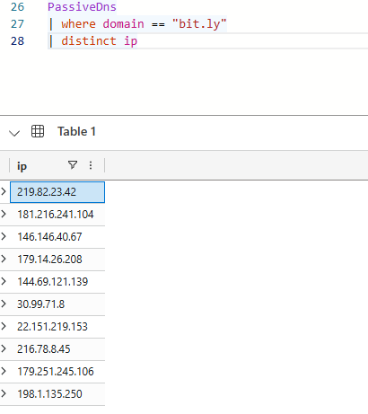
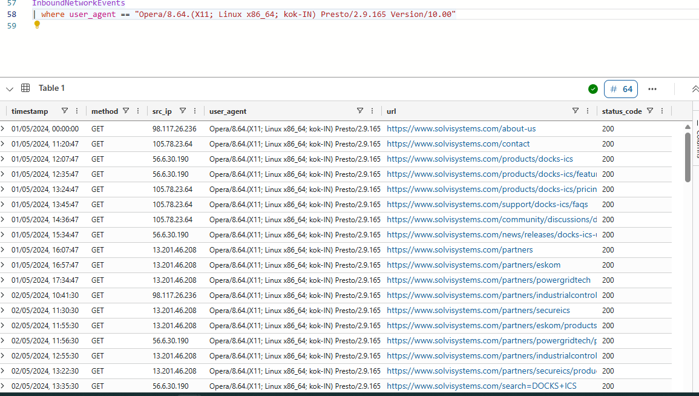
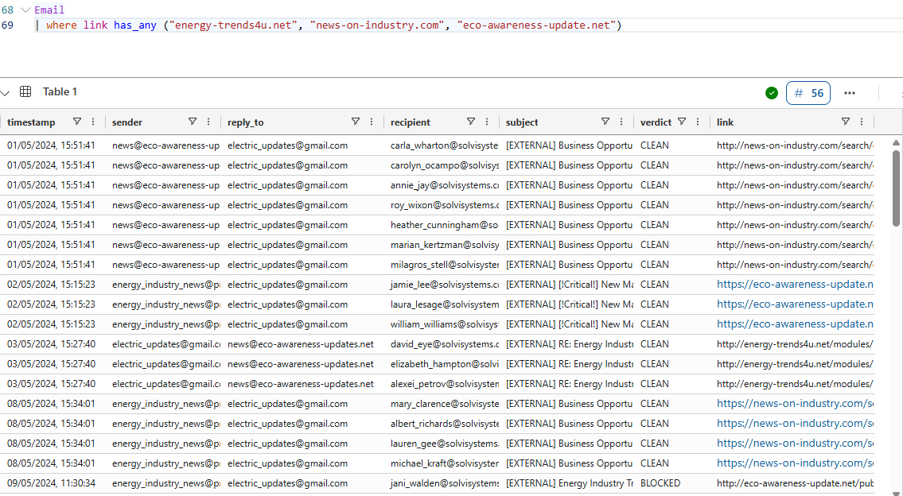
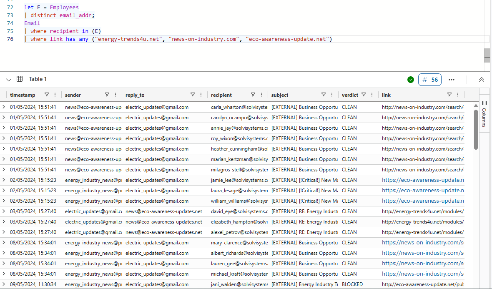
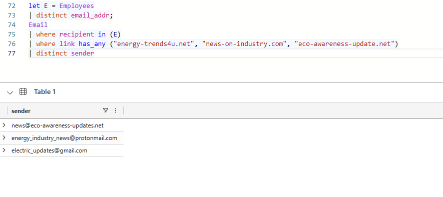
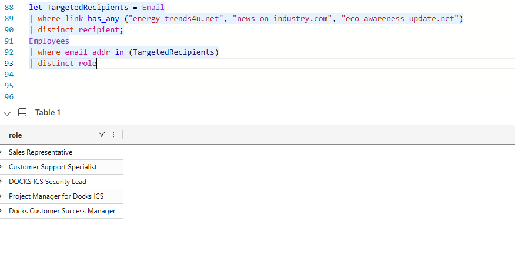
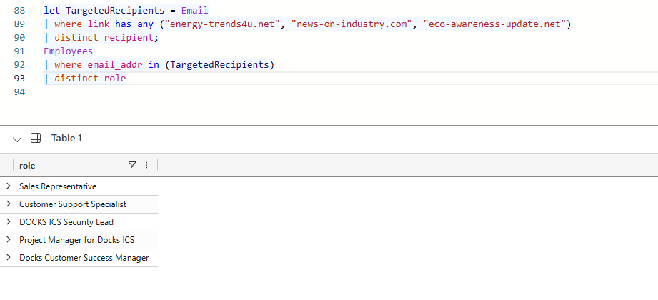
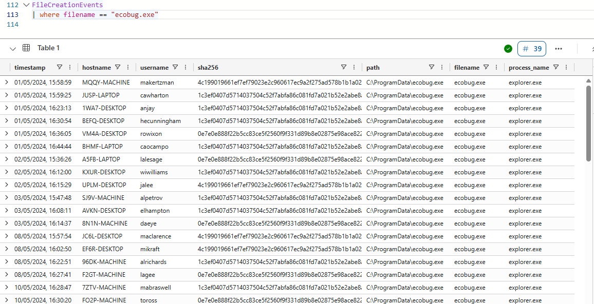

Backgroung - The solvi system is a major and a future shaping energy sector in South Africa At the heart of Solvi Systems' operations is its Docks software, a critical component used by major power and utility companies.

Solvi Systems' influence extends beyond national borders. The company plays a crucial role in regional stability, as South Africa exports power to neighboring states like Mozambique, Eswatini, Zimbabwe, and Namibia. This interconnectedness means that any vulnerability or disruption in South Africa's energy infrastructure, and by extension Solvi Systems' software, doesn't just affect one nation but echoes across the region.

Given this key role, Solvi Systems is a prime target for cyber adversaries. You've been hired to identify any intrusions against this company.
---
Question 2
:   (
10
) points
To start your investigation, you will need access to the company's pool of data!

Login to Azure Data Explorer (ADX). This is where you will find our TOP SECRET data. You will need a Microsoft account (hotmail, outlook, O365..) We will use ADX to run queries that will help us answer these questions.

The training guide will teach you how to answer the KQL101 questions.

Run a take 10 on each of the tables to see what kind of data they contain.

Employees
| take 10
Copy
Anytime you're stuck while trying to write a query, you can always use take 10 to remind yourself what columns and values are in that table!

---
Section 1: KQL 101
Question 3
:   (
10
) points

Now that we have access to the data, we'll need to get a lay of the land. Let's get some more information about Solvi Systems.

How many employees work at Solvi Systems?

Employees
| count

---

Section 1: KQL 101
Question 4
:   (
10
) points
We can use the where operator with the Employees table to find a specific employee.

Here is a template you can follow:

Table
| where <field> <operator> <value>
Copy
To learn more about how to use where, see the training guide.

What is the CTO's name?

Employees
| where role == "CTO"

---
Section 1: KQL 101
Question 5
:   (
10
) points
We can learn more about Alexis Khoza using information from other tables. Let's take her email address from the Employees table and use it in a query for the Email table.

How many emails did Alexis Khoza receive?

Email
| where recipient == "<Alexis Khoza's Email Address Here>"
| count

---

Section 1: KQL 101
Question 6
:   (
10
) points
You can use the distinct operator to find unique values in a specific column.

How many distinct senders were seen in the email logs from eskom.co.za?

Email
| where sender has "<Domain Name>"
| distinct <field>
| count

---

Section 1: KQL 101
Question 7
:   (
10
) points
How many distinct websites did “Alexis Khoza” visit?

OutboundNetworkEvents
| where src_ip == "<Alexis Khoza IP>"
| <operator> <field>
| <operator>

---

Question 8
:   (
10
) points
How many distinct domains in the PassiveDns records contain the word “real”?

PassiveDns
| where <field> contains <value>
| <operator> <field>
| <operator>
Copy
You may notice we're using contains instead of has here. If you are curious about the differences between these, check out this post.

---
Question 9
:   (
10
) points

What IPs did the domain “bit.ly” resolve to (enter any one of them)?

PassiveDns
| where domain == "<domain>"
| distinct <field>

---

Question 10
:   (
10
) points
How many distinct URLs did employees with the first name "Mary" Visit?

let mary_ips = 
Employees
| where name has "<Employee Name>"
| distinct ip_addr;
OutboundNetworkEvents
| where src_ip in (mary_ips)
<more kql here>

---

Question 11
:   (
10
) points
How many authentication attempts did we see to the accounts of employees with the first name Mary?

let <list_variable_name> = Employees
| where name has "<Employee Name>"
| distinct username;
AuthenticationEvents
| where username in (<list_variable_name>)
| count

---

Section 2: Someone's knocking
Question 1
:   (
40
) points
Our mission is to identify any intrusion attempts against Solvi Systems. In order to do this, we'll start by reviewing some alerts.

You got an alert from your Web Application Firewall (WAF) appliance that someone may be trying to compromise your Solvi System's website!

{
   description: "DETECTION RULE TRIGGERED",
   severity: "HIGH",
   rule_description: "SUSPICIOUS TEXT IN HTTP REQUEST",
   data: https://www.solvisystems.com/feedback?message=</script>. 
 
}

---

Question 2
:   (
40
) points
We can actually identify this request in our inbound browsing logs.

InboundNetworkEvents
| where url contains "alert"
Copy
What javascript command was the attacker trying to run?

---

Question 6
:   (
100
) points
Ok, that first attempt was unsuccessful but it may not have been the only one.

Let's look for other malicious requests the attacker could have made around that time. It looks like the attacker varied the ip addresses they used to make these requests.

Use this query as a template:

InboundNetworkEvents
| where user_agent == "<user_agent>"
| where timestamp between (datetime("2024-05-03") .. datetime("2024-05-05"))
Copy
How many malicious requests did the attacker make in total?

---
Question 9 (solved)
:   (
30
) points
It looks like the threat actor did some reconnaissance prior to the attack. They were seen browsing the company website before sending malicious requests to it.

How many total records do we have of them browsing Solvi Systems?

---

Question 12
:   (
40
) points
So we know the web exploitation attempts failed, but surely that couldn't be the end of it. Based on the reconnaissance we saw, these threat actors were far too interested in Solvi Systems to give up that easily.

Let's try pivoting on the adversary infrastructure to see if they tried to get in some other way.

First we'll look in PassiveDns to see if there are any domains registered by the adversary.

How many distinct domains do the ip addresses used by the threat actor resolve to?

---

Hmmm… These domains smell like they were registered for nefarious purposes. Perhaps for…phishing?

Let's check out the email logs to confirm.

Did we receive any emails containing these domains? (yes/no)

---

Oh no! We received so many malicious emails. They weren't done after all!

Good news: we have new leads in our investigation.
Bad news: we have more investigating to do!

Let's explore these malicious emails that were sent by the adversary.

How many emails associated with these domains did SolviSystem employees receive?

---

Section 3: Snail Mail
Question 2
:   (
60
) points
Before we move on, let's try to get a better scope of the investigation.

You'll answer the following questions about the 56 emails we found earlier that had the adversary domains.

How many distinct email addresses did the threat actor use?

---
Question 3
:   (
50
) points
How many distinct filenames were observed in the links in these emails?

---

Question 4
:   (
50
) points
Let's look into the employee roles that this threat actor was targeting.

How many different roles were targeted with these emails?

---

Question 5 (solved)
:   (
50
) points
How many Customer Support Specialist employees received malicious emails?

---

Question 6
:   (
60
) points
Among these job roles, which word is shared by three of them?

---
Question 7 (solved)
:   (
40
) points
We can't investigate all of the emails at once so we'll start by looking in detail at one of the emails.

What was the timestamp of the first email the threat actor sent?

---

Question 14
:   (
40
) points
Did Carla click on the link in email? If so when?

---

Question 15
:   (
40
) points
What file was observed on Carla's machine shortly after she executed the docx file?

---

Section 4: Ecoshock
Question 1 (solved)
:   (
40
) points
How many records do we have of this file being created on Solvi Systems computers?

 39

 

---

Let's go back and look at the process events on Carla's machine to see what happens after ecobug.exe is created.

What IP address does ecobug.exe connect to in order to establish persistence?

