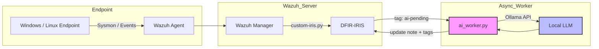
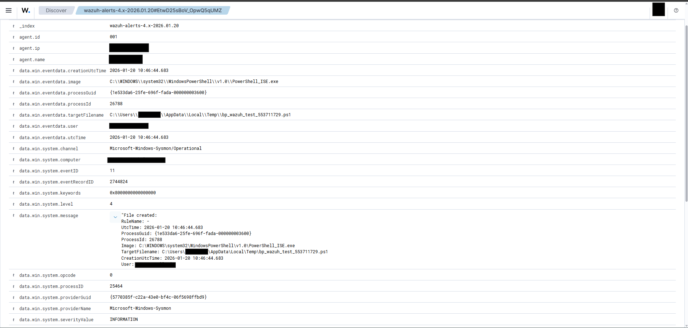
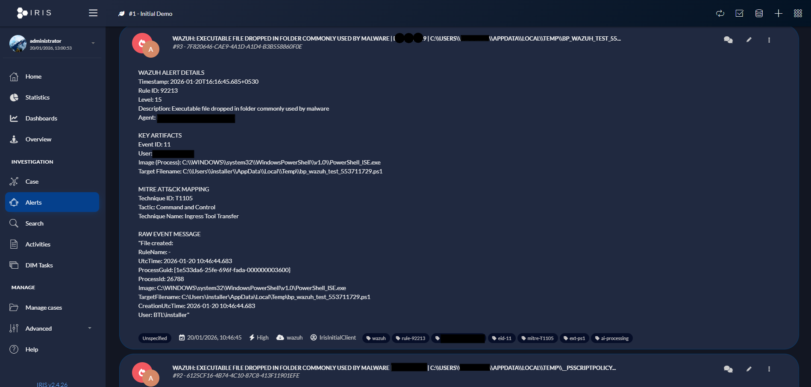

# DFIR-IRIS + Wazuh Integration

### Fast Alert Ingestion with Asynchronous AI Enrichment (Ollama)

> A integration that delivers **immediate Wazuh alerts to DFIR-IRIS**, with **non-blocking AI triage** performed asynchronously using Ollama.

---

## ✨ Key Features

* ⚡ **Fast alert delivery** (no AI blocking the pipeline)
* 🔁 **Asynchronous AI enrichment** using a separate worker
* 🧠 **Local LLM support** (Ollama – CPU friendly)
* 🏷️ **Tag-based locking** for safe horizontal scaling
* 🧹 **Noise reduction** (allowlists, deduplication, burst control)
* 🔐 **Secure by design** (redaction, minimal updates to IRIS)
* 🧩 **Modular & extensible**

---

## 🏗️ Architecture Overview

### High-Level Flow




### Why Async AI?

Running AI **inside** the Wazuh integration can:

* slow alert ingestion
* cause timeouts
* block alerts if Ollama is down

This design keeps alert ingestion **fast and reliable**, while AI runs independently.

---

## 📦 Components

| Component        | Purpose                                              |
| ---------------- | ---------------------------------------------------- |
| `custom-iris.py` | Wazuh integration → sends alerts to IRIS immediately |
| `ai_worker.py`   | Background AI enrichment worker                      |
| DFIR-IRIS        | Case & alert management                              |
| Ollama           | Local LLM runtime (CPU-friendly models)              |
| Sysmon           | High-fidelity Windows telemetry                      |

---

## 📁 Repository Structure

```text
.
├── integrations/
│   ├── custom-iris.py        # Wazuh → IRIS forwarder
│   ├── ai_worker.py          # Async AI enrichment worker
│
├── README.md
```

---

## 🖥️ Screenshots (Placeholders)

> Replace these with real screenshots from your environment.

* **Wazuh Alert View**
 

* **Alert Created in DFIR-IRIS**
  

* **AI Enrichment Added to Same Alert**


---

## 🚀 Installation Guide

### 1️⃣ Install DFIR-IRIS (Docker Recommended)

Follow the official DFIR-IRIS Docker documentation.

https://docs.dfir-iris.org/getting_started/

Verify:

* UI reachable at `https://<iris-ip>:8443`
* API bearer token created

---

### 2️⃣ Wazuh + Sysmon Setup

On Windows endpoints:

* Install **Sysmon**
* Use a standard configuration (SwiftOnSecurity or equivalent)

Confirm Wazuh receives:

* Sysmon Event ID 1 (Process Create)
* Sysmon Event ID 3 (Network Connection)
* Sysmon Event ID 11 (File Creation)

---

### 3️⃣ Deploy `custom-iris.py` (Wazuh Manager)

```bash
cp custom-iris.py /var/ossec/integrations/
chmod +x /var/ossec/integrations/custom-iris.py
```

Add integration to `ossec.conf`:

```xml
<integration>
  <name>custom-iris.py</name>
  <hook_url>https://IRIS_IP:8443/alerts/add</hook_url>
  <api_key>IRIS_BEARER_TOKEN</api_key>
  <alert_format>json</alert_format>
</integration>
```

Restart Wazuh:

```bash
systemctl restart wazuh-manager
```

Monitor:

```bash
tail -f /var/ossec/logs/integrations.log
```

---

### 4️⃣ Install Ollama + Model

Install Ollama on a local host (Linux or Windows).

Pull a CPU-friendly model:


```bash
ollama pull phi4-mini:latest
```


Benchmark generation:

```bash
/usr/bin/time -f "RESPONSE: %e sec" \
curl -X POST http://OLLAMA_IP:11434/api/generate \
  -H "Content-Type: application/json" \
  -d '{"model":"phi4-mini:latest","prompt":"OK","stream":false}'
```

---

### 5️⃣ Deploy `ai_worker.py`

```bash
cp ai_worker.py /var/ossec/integrations/
chmod +x /var/ossec/integrations/ai_worker.py
```

Run (low-resource setup – 3-minute cycle):

```bash
export IRIS_BASE_URL="https://IRIS_IP:8443"
export IRIS_BEARER="IRIS_BEARER_TOKEN"
export OLLAMA_URL="http://OLLAMA_IP:11434/api/generate"
export OLLAMA_MODEL="phi4-mini:latest"

export AI_WORKER_POLL_SECONDS=60 # For Testing
export AI_WORKER_MAX_PER_CYCLE=3

nohup python3 /var/ossec/integrations/ai_worker.py \
  >> /var/ossec/logs/ai_worker.log 2>&1 &
```

Logs:

```bash
tail -f /var/ossec/logs/ai_worker.log
```

---

## 🏷️ Tag Workflow (Critical)

| Tag             | Meaning              |
| --------------- | -------------------- |
| `ai-pending`    | Awaiting AI analysis |
| `ai-processing` | Claimed by worker    |
| `ai-reviewed`   | AI triage completed  |

This ensures:

* no duplicate AI work
* safe retries
* multi-worker scalability

---

## 🧪 End-to-End Testing (Windows Agent)

```powershell
cmd.exe /c whoami
powershell -NoProfile -ExecutionPolicy Bypass -Command "Write-Output test"
"test" | Out-File "$env:TEMP\\bp_test.ps1"
powershell Test-NetConnection 1.1.1.1 -Port 443
runas /user:.\\NoSuchUser cmd
```

Confirm:

* Wazuh integration logs show sent alerts
* Alert appears in IRIS immediately
* AI review is added later to the **same alert**

---

## 🔐 Security Notes

* Store secrets in environment variables
* Enable SSL verification in production
* Redaction applied before AI prompts
* AI worker updates **only** notes and tags

---

## 📈 Scalability Notes

* Multiple `ai_worker.py` instances supported
* Increase batch size gradually
* Tag locking prevents race conditions
* Async design prevents alert loss

---

## ❗ Known Limitations

* Wazuh does not replay alerts if IRIS is down
* Store-and-forward can be added if required
* AI output quality depends on model choice

---

## 🧠 Design Rationale

* SOC-first: alerts first, enrichment later
* AI is optional and non-blocking
* Clear audit trail in IRIS
* Easy to extend or replace AI layer


## 🙌 Acknowledgements

* DFIR-IRIS
* Wazuh
* Ollama
* Open-source SOC community
